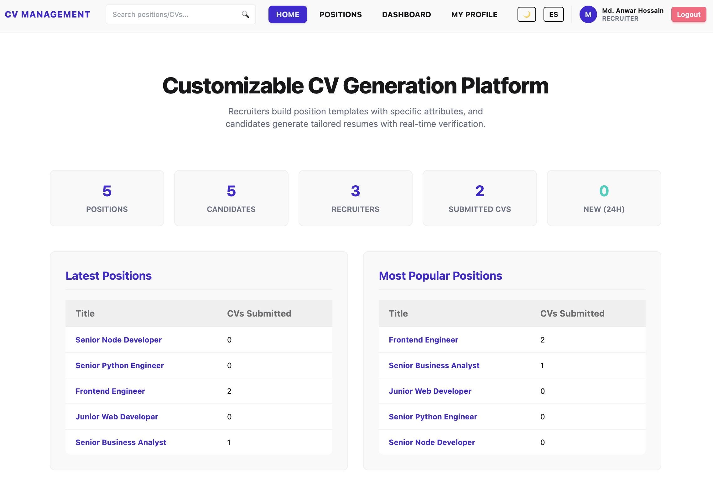

# CV Management System

A full-stack, enterprise-grade **Customizable CV Generation & Job Matching Platform** built with **React 19, Node.js, Express, Prisma ORM, and PostgreSQL**.

The application enables recruiters to build dynamic position templates with custom attributes and automated eligibility access rules, while candidates can generate verified, tailored CV profiles and export them directly to PDF.



---

## 🔗 Project Links

- **Live Demo**: [https://cv-management-system-client.onrender.com](https://cv-management-system-client.onrender.com)
- **GitHub Repository**: [https://github.com/ranak8811/CV-Management-System.git](https://github.com/ranak8811/CV-Management-System.git)

> ⚡ **Important Note on Live Deployment**:
> This project is hosted on **Render's Free Tier**. If the application has been idle, the server will spin down automatically. The initial request may take **up to 1 minute** to wake up the server and load the web page. Subsequent navigation will be instantaneous.

---

## 🛠️ Tech Stack

### **Frontend**

- **Framework**: React 19 (Vite)
- **Styling & UI**: Tailwind CSS v4, DaisyUI v5 (Light/Dark themes)
- **State & Data Fetching**: TanStack Query v5 (React Query)
- **Routing**: React Router DOM v7
- **Form Management**: React Hook Form
- **Internationalization**: `i18next`, `react-i18next` (English & Spanish UI)
- **Real-time WebSockets**: Socket.io-client
- **PDF Export**: `html2pdf.js` & `jspdf`
- **Notifications**: React Hot Toast, SweetAlert2
- **OAuth**: `@react-oauth/google`

### **Backend**

- **Runtime**: Node.js (ES Modules)
- **Web Framework**: Express.js
- **Database & ORM**: PostgreSQL (Serverless via Neon PostgreSQL) with Prisma ORM v7
- **Authentication**: JSON Web Tokens (JWT), BcryptJS
- **Email Service**: Brevo (Sendinblue) REST API v3
- **Real-Time Engine**: Socket.io
- **API Security**: CORS, Rate Limiting, RBAC Middlewares

---

## ✨ Main Features

### 1. 👥 Role-Based Access Control (RBAC)

- **Candidate**: Builds professional profiles, populates required attribute values, creates project portfolios, and exports/submits CVs to position openings.
- **Recruiter**: Defines dynamic custom attributes, creates position templates with access rules, duplicates positions, and reviews submitted candidate CVs.
- **Admin**: All recruiter privileges plus comprehensive user management (blocking/unblocking accounts, changing roles, and account deletion).

### 2. 📚 Dynamic Attribute Library

- Define reusable metadata keys categorized by **Personal Information**, **Technical Skills**, **Soft Skills**, **Domain Knowledge**, and **Certifications**.
- Supports multiple data types: `STRING`, `NUMBER`, `BOOLEAN`, `DATE`, and `DROPDOWN` (with custom option arrays).

### 3. 🎯 Position & Template Management

- Create public or restricted job positions specifying `maxProjects` allowed and technology tags filters.
- Define **Access Rules** (e.g., `Experience Years GREATER_THAN 2` or `Degree CONTAINS Computer`) to restrict un-qualified candidates from accessing restricted positions.
- Includes one-click position duplication and access rule badge rendering.

### 4. 📄 CV Profile Generation & PDF Export

- Dynamic profile forms automatically adapt to display fields requested by target position templates.
- Export high-fidelity, beautifully styled PDF resumes directly from the browser using `html2pdf.js`.
- Project portfolio management with technology tagging and start/end dates.

### 5. 🔍 Global Search & CV Browser

- Header full-text search bar searching across candidate names, CV titles, and candidate attribute values.
- Filter CVs and positions by category, tags, and popularity metrics.
- **Social Interactivity**: Liking system (`CVLike`) tracking total CV appreciation.

### 6. 💬 Real-Time Discussion Feed

- Live discussion thread on every position detail page powered by **Socket.io**.
- Markdown text rendering via `marked` for clean comment formatting.

### 7. 🔒 Multi-Method Authentication & Verification

- **Email & Password Registration**: Includes Brevo API integration sending double opt-in email verification links (`GET /api/auth/verify?token=...`).
- **OAuth 2.0 Integration**: One-click authentication via **Google OAuth** and **GitHub OAuth**.
- Admin account safety checks preventing self-blocking or self-deletion.

### 8. 🌐 Internationalization (i18n) & UI Customization

- Full UI translation support for **English** and **Spanish** using `react-i18next`.
- Light and Dark mode theme toggle integrated with DaisyUI themes.
- Dynamic document title management (`useTitle` hook) across all 12 routes.

---

## 🚀 Local Setup & Installation

Follow these steps to run the application locally on your machine.

### **Prerequisites**

- [Node.js](https://nodejs.org/) (v18 or higher recommended)
- [Git](https://git-scm.com/)
- A PostgreSQL database instance (or a free account on [Neon.tech](https://neon.tech))
- Brevo API Key (for email verification) & OAuth Client Credentials (optional for local dev)

---

### **1. Clone the Repository**

```bash
git clone https://github.com/ranak8811/CV-Management-System.git
cd CV-Management-System
```

---

### **2. Backend Setup (`server`)**

1. Navigate to the `server` directory and install dependencies:

   ```bash
   cd server
   npm install
   ```

2. Create a `.env` file inside the `server/` folder:

   ```env
   PORT=5000
   DATABASE_URL="postgresql://<user>:<password>@<host>/<database>?sslmode=require"
   JWT_SECRET="your_jwt_secret_key_here"

   # Optional: Frontend Client URL for CORS & Email Verification Redirects
   CLIENT_URL="http://localhost:5173"
   BACKEND_URL="http://localhost:5000"

   # Brevo Email Verification Credentials (Optional for local - fallback links logged in terminal)
   BREVO_API_KEY="your_brevo_api_key"
   BREVO_SENDER_EMAIL="your_verified_sender@email.com"
   BREVO_SENDER_NAME="CV Management System"

   # OAuth Credentials (Optional)
   GOOGLE_CLIENT_ID="your_google_client_id"
   GITHUB_CLIENT_ID="your_github_client_id"
   GITHUB_CLIENT_SECRET="your_github_client_secret"
   ```

3. Synchronize the database schema using Prisma:

   ```bash
   npx prisma db push
   ```

4. Start the backend development server:
   ```bash
   npm run dev
   ```
   The backend API will run on `http://localhost:5000`.

---

### **3. Frontend Setup (`client`)**

1. Open a new terminal, navigate to the `client` directory, and install dependencies:

   ```bash
   cd client
   npm install
   ```

2. Create a `.env` file inside the `client/` folder:

   ```env
   VITE_API_URL="http://localhost:5000"
   VITE_GOOGLE_CLIENT_ID="your_google_client_id"
   VITE_GITHUB_CLIENT_ID="your_github_client_id"
   ```

3. Start the frontend development server:
   ```bash
   npm run dev
   ```
   The client application will run on `http://localhost:5173`.

---

## 📂 Project Directory Structure

```text
CV-Management-System/
├── client/                     # Frontend React (Vite) Application
│   ├── public/                 # Static assets & screenshots
│   │   └── home_page.png
│   ├── src/
│   │   ├── components/         # Reusable Table, Modals, Navbar, Loading
│   │   ├── context/            # Auth & Language React Contexts
│   │   ├── hooks/              # Custom hooks (useAuth, useLanguage, useTitle, useTheme)
│   │   ├── layouts/            # RootLayout, AuthLayout, DashboardLayout
│   │   ├── pages/              # Admin, Attributes, CVs, Dashboard, Home, Positions, Profile
│   │   ├── providers/          # Query, Auth, Language & Theme Providers
│   │   ├── router/             # React Router DOM configuration & ProtectedRoute
│   │   ├── utils/              # Axios instance & helper utilities
│   │   ├── i18n.js             # i18next resources & configuration
│   │   └── main.jsx            # Application entry point
│   └── package.json
│
├── server/                     # Backend Node.js / Express Application
│   ├── prisma/                 # Prisma schema definition & migrations
│   │   └── schema.prisma
│   ├── src/
│   │   ├── config/             # DB & Prisma Client setup
│   │   ├── controllers/        # Admin, Auth, Attribute, CV, Position, Profile controllers
│   │   ├── middlewares/        # JWT Protect & Role Authorization middlewares
│   │   ├── routes/             # Express API routes
│   │   ├── utils/              # Brevo email verification service
│   │   └── index.js            # Express server entry point with Socket.io
│   └── package.json
│
└── README.md                   # Project documentation
```

---

## 🛡️ License

This project is open-source and available under the [MIT License](LICENSE).
